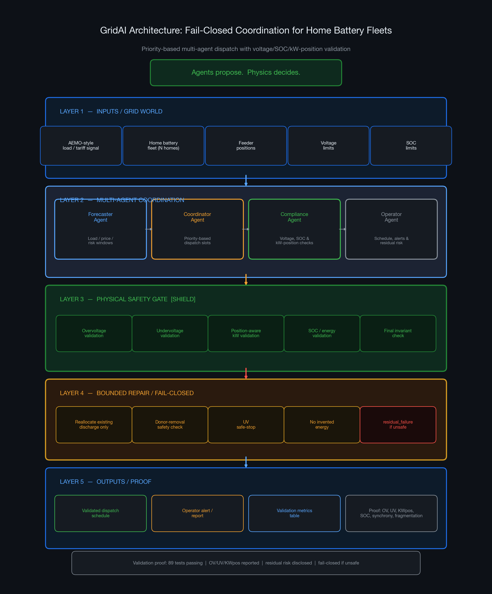
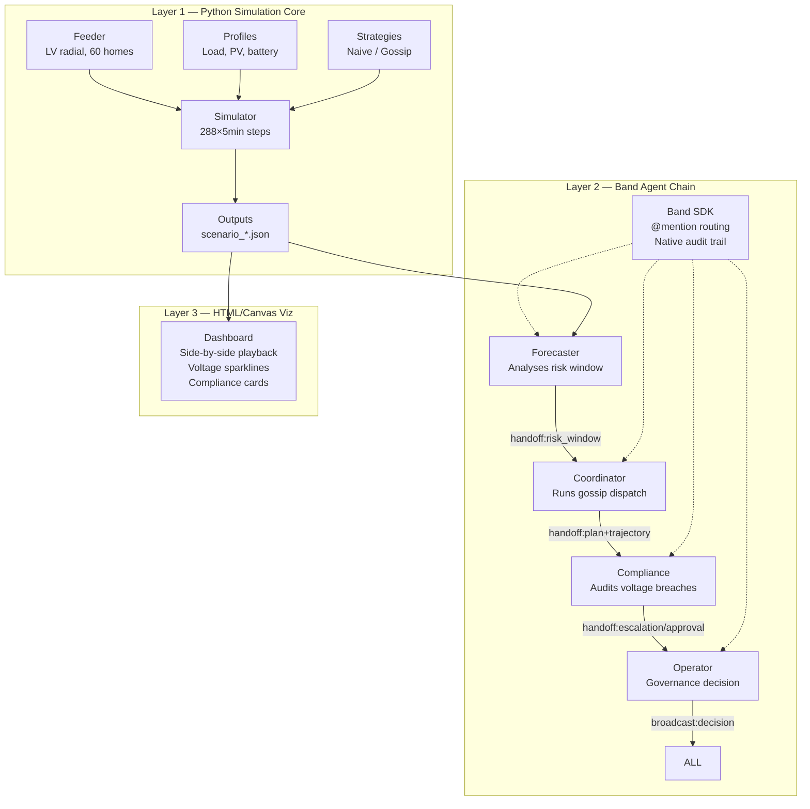

# GridAI — Battery Fleet Coordination Protocol

GridAI solves the herding problem in distributed energy resource (DER) coordination.

[](https://dexflex66.github.io/gridai/)
[](#)
[](#)

## The Problem

When thousands of home batteries follow the same price signal, they all discharge simultaneously and create a **new synchronised demand spike** instead of smoothing the existing one. This is the **herding problem** — and it pushes voltage above legal limits (AS IEC 60038:2022 band: 0.94–1.10 pu) at the edge of the distribution network.

## The Solution

A priority-based coordination protocol where the Coordinator allocates each battery's dispatch slot using global fleet state to desynchronise the fleet, producing a flatter aggregate demand curve while respecting voltage limits and owner preferences.

**Critical design point:** desynchronisation comes from fleet **heterogeneity** (varied private thresholds and SOC), not from negotiation alone. The protocol channels heterogeneity; on a homogeneous fleet it only weakly desynchronises.

## Architecture



**Agents propose. Physics decides.** *GridAI separates agent coordination from physical acceptance: agents propose dispatch schedules, but voltage/SOC/kW validation decides whether a schedule is accepted, repaired, or reported as residual risk.*



### Layers

| Layer | Status | Description |
|-------|--------|-------------|
| **Layer 1** | ✅ Done | Python simulation: LV feeder, battery agents, naive & gossip protocols, AEMO 2012 load data |
| **Layer 2** | ✅ Done | Four agents (Forecaster, Coordinator, Compliance, Operator) collaborating over **real Band SDK** as the transport bus. Verified live against `app.band.ai` with full parity to mock. |
| **Layer 3** | ✅ Done | Self-contained HTML/Canvas dashboard — side-by-side naive vs gossip playback, voltage sparklines, Band audit-trail panels, compliance cards. Deployed on GitHub Pages. |

## Key Results

| Metric | Naive (price-following) | Gossip-style coordination |
|--------|:-----------------------:|:----------------------:|
| Battery-herding overvoltage events | **471** | **0** |
| Overvoltage steps (evening peak) | 14 steps | 0 steps |
| Max simultaneous discharge (synchrony) | 1.000 (60/60 homes) | **0.167** (10/60 homes) |
| Convergence rounds | — | 1–2 |
| Peak aggregate demand change (heterogeneous) | baseline | −0.9% |

All numbers verified against AEMO 2012 Victorian summer data and backed by **89 automated tests**.

## Quick Start

```bash
cd gridai
python3 -m venv .venv && source .venv/bin/activate
pip install -r requirements.txt

# Run all scenarios and write outputs/
python3 sim/runner.py

# Run 4-agent Band chain (mock, offline)
python3 agents/run_agents.py

# Run tests
pytest tests/ -v

# Run final validation reproducibility report
python sim/runner.py          # ensures all outputs exist
python scripts/run_final_validation.py
```

### Run against real Band

```bash
cp .env.example .env
# Fill in your Band API keys from app.band.ai
export USE_REAL_BAND=true
python3 agents/run_agents.py
```

## Output Files

All simulation outputs written to `outputs/`:
- `scenario_naive_homogeneous.json` — herding baseline, identical thresholds
- `scenario_naive_heterogeneous.json` — herding baseline, varied thresholds
- `scenario_gossip_homogeneous.json` — protocol on homogeneous fleet
- `scenario_gossip_heterogeneous.json` — protocol on heterogeneous fleet
- `scenario_*_aemo.json` — same scenarios driven by AEMO 2012 Victorian load
- `summary.json` / `summary_aemo.json` — headline metrics
- `band_audit_*.json` / `compliance_decision_*.json` — agent chain records

Agent-chain outputs written to `outputs/`:
- `band_audit_naive_aemo.json` — full 8-entry Band audit log
- `band_audit_gossip_aemo.json` — same for gossip scenario
- `compliance_decision_*.json` — escalation/approval records
- `band_parity_report.md` — mock vs real Band parity verification

## Project Structure

```
gridai/
├── sim/                  # Layer 1 — Simulation core
│   ├── feeder.py         #   LV radial feeder (N=60, prefix-sum voltage)
│   ├── profiles.py       #   Load, PV, battery profiles, make_homes()
│   ├── strategies.py     #   Naive & gossip protocols
│   ├── simulator.py      #   24h simulation engine
│   ├── aemo.py           #   AEMO 2012 Victorian load data
│   └── runner.py         #   Scenario runner
├── agents/               # Layer 2 — Band agent chain
│   ├── band_interface.py #   Abstract Band interface
│   ├── mock_band.py      #   In-process mock implementation
│   ├── real_band.py      #   Real Band SDK transport bus
│   ├── forecaster.py     #   Risk-window analysis agent
│   ├── coordinator.py    #   Gossip dispatch coordinator
│   ├── compliance.py     #   Voltage compliance auditor
│   ├── grid_operator.py  #   Human governance operator
│   └── run_agents.py     #   Chain runner
├── viz/                  # Layer 3 — HTML/Canvas visualisation
│   ├── gridai_demo.html  #   Self-contained dashboard (deployed)
│   ├── build_demo.py     #   Generates dashboard from JSON
│   └── screenshots/      #   Verified render captures
├── tests/                # 89 tests (pytest)
│   ├── test_simulation.py
│   ├── test_aemo.py
│   ├── test_agents.py
│   └── test_coherence_verification.py
├── outputs/              # Generated scenario + agent data
├── submission/           # lablab.ai submission package
└── docs/                 # GitHub Pages deployment (mirror of viz/)
```

## Limitations

GridAI is a hackathon prototype, not a production DERMS. The current public results are simulation-based and do not use live feeder telemetry. The feeder model is simplified and does not yet include full three-phase unbalanced power-flow validation. The coordination architecture is priority-based/hybrid through a Coordinator and should not be described as fully decentralised peer-to-peer control. The current public baseline reports residual undervoltage in the relevant scenario (435 battery-herding undervolt events in the gossip-heterogeneous AEMO case); this is disclosed as a limitation and future voltage-support target. Future work includes feeder-specific validation, improved voltage-support optimisation, lower fragmentation/synchrony, and deployment-grade safety testing.

## Submissions & Links

- **Live demo:** https://dexflex66.github.io/gridai/
- **Pitch video:** `final/gridai_submission_video_TRUEFINAL.mp4` (90s, 1920×1080)
- **Slide deck:** `submission/gridai_lablab_band_of_agents_2026/assets/gridai_pitch_deck.pdf`
- **Submission form:** `SUBMISSION.md`
- **Narration script:** `viz/NARRATION.md`

## Hackathon

lablab.ai **Band of Agents Hackathon** · Track: **Regulated and High-Stakes Workflows**.
Submission deadline: June 19, 2026 15:00 UTC.
